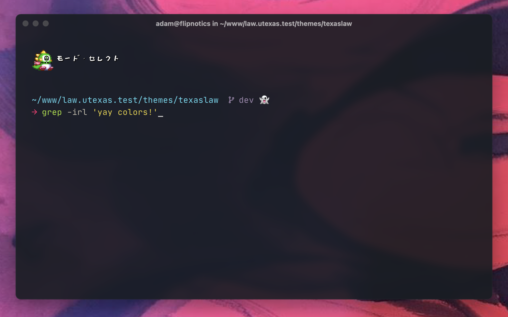

# adamnorwood-zsh

Adam Norwood's Z shell (zsh) configuration with custom [Oh My Posh](https://ohmyposh.dev/) theme.

After years of running the bulkier (but handy) Oh My Zsh framework, I realized that most of what I want could be easily achieved if I just learned how to make good use of the built-in features of zsh itself…with a bit of help from Oh My Posh for making a great-looking prompt.

Designed to be minimalist but readable, and also fun, this is where I've ended up.

